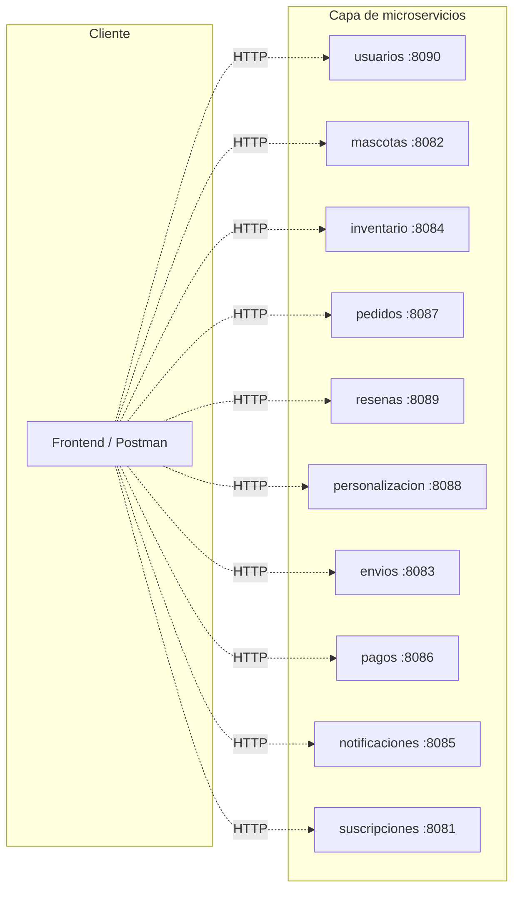
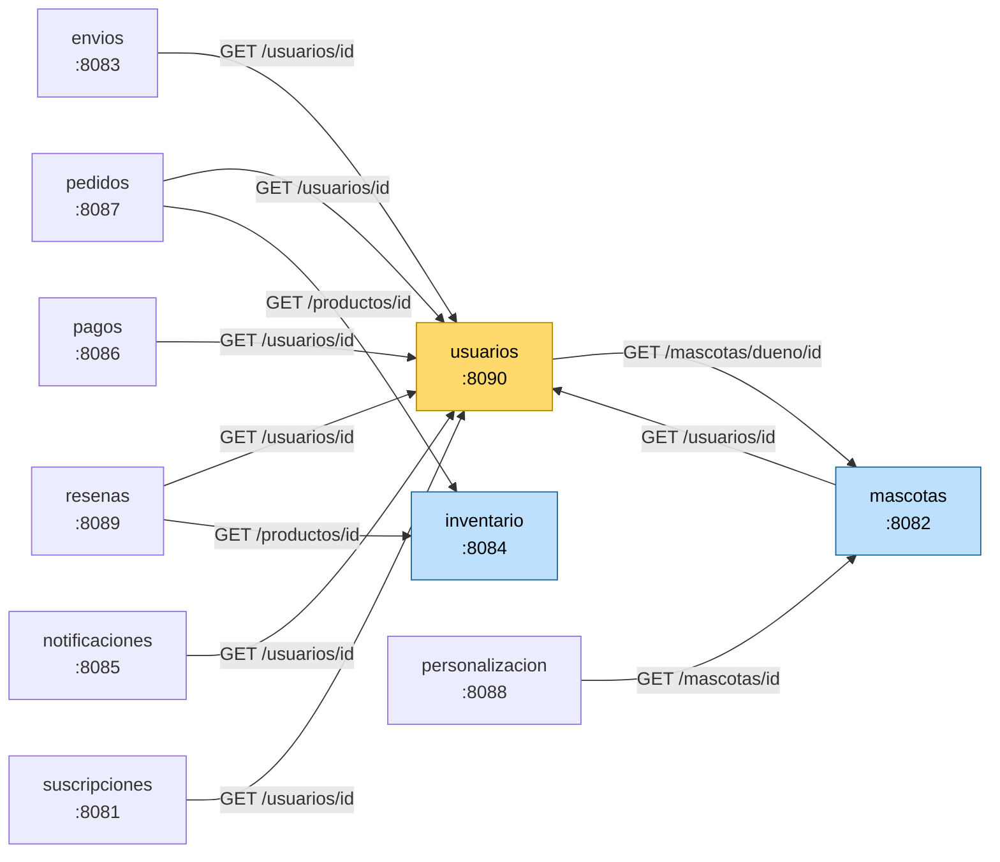
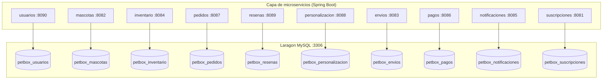

# PetBox — Plataforma de microservicios

Sistema full-stack basado en **10 microservicios Spring Boot** independientes, cada uno con su propia base de datos MySQL. Cubre el dominio completo de una tienda especializada en mascotas: usuarios, mascotas, suscripciones a cajas de productos personalizadas, inventario, pedidos, pagos, envíos, notificaciones y reseñas.

---

## Tabla de contenidos

1. [Equipo](#equipo)
2. [Arquitectura general](#arquitectura-general)
3. [Microservicios y puertos](#microservicios-y-puertos)
4. [Diagrama de comunicación entre servicios](#diagrama-de-comunicación-entre-servicios)
5. [Diagrama de capas (BD por servicio)](#diagrama-de-capas-bd-por-servicio)
6. [Stack tecnológico](#stack-tecnológico)
7. [Estructura del repositorio](#estructura-del-repositorio)
8. [Requisitos previos](#requisitos-previos)
9. [Cómo ejecutar un microservicio](#cómo-ejecutar-un-microservicio)
10. [Endpoints principales](#endpoints-principales)
11. [Mejoras pendientes / bugs conocidos](#mejoras-pendientes--bugs-conocidos)

---

## Equipo

Proyecto desarrollado de forma colaborativa por el equipo de la asignatura **Desarrollo Full-Stack**.

| Integrante | Rol principal | Microservicios a cargo |
|---|---|---|
| Integrante 1 | Backend / coordinación | usuarios, mascotas, suscripciones |
| Integrante 2 | Backend / dominio comercial | pedidos, pagos, envíos, inventario |
| Integrante 3 | Backend / dominio de personalización | personalizacion, notificaciones, resenas |

> El historial de commits del repositorio evidencia la participación individual de cada integrante.

---

## Arquitectura general

PetBox sigue una arquitectura de **microservicios independientes** que se comunican entre sí mediante **HTTP REST** usando `RestTemplate`. Cada microservicio:

- Es un módulo Spring Boot autónomo con su propio `pom.xml`.
- Tiene su propia **base de datos MySQL** (patrón *database-per-service*).
- Expone su API REST en un puerto único.
- Se despliega de forma independiente.



---

## Microservicios y puertos

| Servicio | Puerto | Endpoint base | Base de datos | Responsabilidad |
|---|---|---|---|---|
| `suscripciones` | **8081** | `/suscripciones` | `petbox_suscripciones` | Planes y suscripciones recurrentes |
| `mascotas` | **8082** | `/mascotas` | `petbox_mascotas` | Datos de mascotas y dueños |
| `envios` | **8083** | `/envios` | `petbox_envios` | Estado y seguimiento de envíos |
| `inventario` | **8084** | `/productos` | `petbox_inventario` | Catálogo de productos y stock |
| `notificaciones` | **8085** | `/notificaciones` | `petbox_notificaciones` | Envío de notificaciones a usuarios |
| `pagos` | **8086** | `/pagos` | `petbox_pagos` | Procesamiento de pagos |
| `pedidos` | **8087** | `/pedidos` | `petbox_pedidos` | Gestión de pedidos del cliente |
| `personalizacion` | **8088** | `/personalizaciones` | `petbox_personalizacion` | Preferencias de la caja por mascota |
| `resenas` | **8089** | `/resenas` | `petbox_resenas` | Reseñas y calificaciones de productos |
| `usuarios` | **8090** | `/usuarios` | `petbox_usuarios` | Registro y autenticación de clientes |

---

## Diagrama de comunicación entre servicios

`usuarios` es el **hub central** del sistema: casi todos los servicios lo consultan para enriquecer respuestas. `inventario` es el segundo más consumido. Todas las llamadas se hacen con `RestTemplate.getForObject(...)` desde el método `buscarDetallePorId(...)` de cada `*Service.java`.



### Resumen textual

- `mascotas` → `usuarios` (y `usuarios` ↔ `mascotas`, bidireccional)
- `pedidos` → `usuarios`, `inventario`
- `resenas` → `usuarios`, `inventario`
- `personalizacion` → `mascotas`
- `envios` → `usuarios`
- `pagos` → `usuarios`
- `notificaciones` → `usuarios`
- `suscripciones` → `usuarios`
- `inventario` → (sin dependencias salientes)

---

## Diagrama de capas (BD por servicio)

Cada microservicio crea automáticamente su propia base de datos en MySQL (`createDatabaseIfNotExist=true`).



---

## Stack tecnológico

- **Java 21**
- **Spring Boot 4.0.x**
  - Spring Web MVC
  - Spring Data JPA
  - Spring Validation
- **MySQL 8** (servido localmente por **Laragon** en el puerto `3306`)
- **Lombok** para reducir boilerplate
- **Maven Wrapper** (`mvnw` / `mvnw.cmd`)
- **BCrypt** para hash de contraseñas (en `usuarios`)
- **RestTemplate** para comunicación HTTP entre microservicios

---

## Estructura del repositorio

```
DESARROLLO FULLSATCK/
├── README.md                  ← este archivo
├── .gitignore
├── envios/                    ← microservicio (Spring Boot)
│   ├── pom.xml
│   └── src/main/java/com/petbox/envios/...
├── inventario/
├── mascotas/
├── notificaciones/
├── pagos/
├── pedidos/
├── personalizacion/
├── resenas/
├── suscripciones/
└── usuarios/
```

Dentro de cada microservicio la estructura sigue el patrón:

```
<servicio>/
├── pom.xml
├── mvnw, mvnw.cmd
└── src/main/java/com/petbox/<servicio>/
    ├── PetBox<Servicio>Application.java     ← clase main
    ├── ManejadorErrores.java                ← @RestControllerAdvice global
    ├── controller/                          ← endpoints REST
    ├── service/                             ← lógica de negocio
    ├── repository/                          ← JPA repositories
    ├── model/                               ← entidades JPA
    └── dto/                                 ← DTOs de entrada/salida
```

---

## Requisitos previos

- **JDK 21** (Temurin/OpenJDK)
- **Maven 3.9+** (o usar el wrapper incluido `./mvnw`)
- **Laragon** con MySQL corriendo en el puerto `3306` (usuario `root`, sin contraseña por defecto)
- **Postman** (opcional, para probar endpoints)

> Las bases de datos se crean automáticamente al arrancar cada microservicio gracias a `createDatabaseIfNotExist=true` y `spring.jpa.hibernate.ddl-auto=update`.

---

## Cómo ejecutar un microservicio

Desde la raíz del proyecto, ir a la carpeta del microservicio y correr Spring Boot con el wrapper de Maven:

```bash
cd mascotas
./mvnw spring-boot:run        # Linux / macOS
mvnw.cmd spring-boot:run      # Windows
```

Para correr todos los microservicios hay que abrir una terminal por servicio (10 terminales). Más adelante se puede orquestar con `docker-compose` (ver sección de mejoras).

### Verificar que arrancó

```bash
curl http://localhost:8082/mascotas        # listar mascotas
curl http://localhost:8090/usuarios        # listar usuarios
```

---

## Endpoints principales

Cada microservicio expone el mismo patrón CRUD básico:

| Método | Ruta | Descripción |
|---|---|---|
| `POST` | `/<recurso>` | Crea un nuevo recurso (valida con Bean Validation) |
| `GET` | `/<recurso>` | Lista todos los recursos (DTO de listado) |
| `GET` | `/<recurso>/{id}` | Detalle enriquecido (incluye datos de servicios relacionados) |

Ejemplo para `pedidos`:

```http
POST http://localhost:8087/pedidos
Content-Type: application/json

{
  "usuarioId": 1,
  "productoId": 2,
  "cantidad": 3
}
```

```http
GET http://localhost:8087/pedidos/1
```

La respuesta de `GET /<recurso>/{id}` incluye los objetos enriquecidos consultados a otros microservicios (por ejemplo, los datos del usuario y del producto en el caso de un pedido).

---

## Mejoras pendientes / bugs conocidos

Este monorepo es la **versión inicial** del proyecto. Quedan pendientes:

- [ ] **Puerto de `usuarios` mal referenciado en varios servicios**: la mayoría apunta a `localhost:8081/usuarios/...`, pero `usuarios` corre en el `8090`. El módulo `resenas` ya está corregido. Falta corregir `mascotas`, `pedidos`, `notificaciones`, `envios`, `pagos` y `suscripciones`.
- [ ] **Bug en `application.properties` de `usuarios`**: el datasource apunta a `petbox_inventario` en lugar de `petbox_usuarios`.
- [ ] **Externalizar URLs**: usar `@Value("${services.usuarios.url}")` en lugar de URLs hardcodeadas.
- [ ] **Tolerancia a fallos**: integrar Resilience4j (circuit breaker, retry, timeout).
- [ ] **Service Discovery**: Spring Cloud Eureka.
- [ ] **API Gateway**: Spring Cloud Gateway con autenticación JWT centralizada.
- [ ] **Containerización**: `Dockerfile` por servicio + `docker-compose.yml` raíz.
- [ ] **CI**: workflow de GitHub Actions que compile todos los servicios en cada push.
- [ ] **Tests de integración**: actualmente solo hay tests de carga de contexto generados por Spring Initializr.

---

## Licencia

Proyecto académico — uso interno del equipo de desarrollo.
